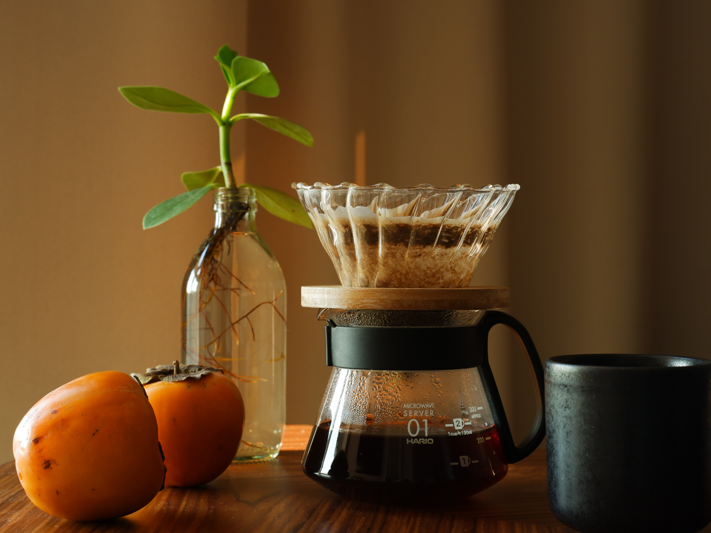

# 첫 웹 사이트 제작기

앞으로 어떻게 블로그를 사용해야되며, CSS와 html, 웹 사이트에 사용된 사진 등을 어떻게 올려야 되는지 공부를 해야겠다. 

<!DOCTYPE html>
<html>
  <head>
    <meta charset="utf-8">
    <title>커피 이야기</title>
    
    
  </head>

  <body>
    <link rel="preconnect" href="https://fonts.googleapis.com">
    <link rel="preconnect" href="https://fonts.gstatic.com" crossorigin>
    <link href="https://fonts.googleapis.com/css2?family=Gaegu:wght@300&display=swap" rel="stylesheet">

  <h1>COFFEE 이야기</h1>

    <h3 style=text-align:center>커피 유래</h3>
    
<strong>커피</strong>는 7세기 이전부터 에티오피아의 고대에서 자생하고 있던 것으로 보인다. 전설에 따르면 염소 목이었던 칼디(Kaldi)가 우연히 염소들이 먹던 열매를 발견했고 매를 마을에 가져오는데, 피곤함을 덜어주는 <strong>커피</strong>의 효능을 마을의 종교 수행자들을 돕기 위해 쓰게 되다고 전해지고 있다.

    

    <h3 style=text-align:center>원두 종류</h3>
    <ol>
      <li><a href="아라비카.html">아라비카</a></li>
      <li><a href="로브스타.html">로브스타</a></li>
      <li><a href="리베리카.html">리베리카</a></li>
    </ol>
    

    <h3 style=text-align:center>커피 종류</h3>
    <ol>
      <li><a href="에스프레소.html">에스프레소</a></li>
      <li><a href="아메리카노.html">아메리카노</a></li>
      <li><a href="카페라테.html">카페라테</a></li>
      <li><a href="마키아토.html">마키아토</a></li>
      <li><a href="카페모카.html">카페모카</a></li>
      <li><a href="아포카토.html">아포카토</a></li>
    </ol>
    

더 궁금한 사항이 있으면 <strong>댓글</strong> 또는 우측하단의 <strong>채팅 기능</strong>을 사용해주세요!

    

<noscript>Please enable JavaScript to view the <a href="https://disqus.com/?ref_noscript">comments powered by Disqus.</a></noscript>
<!--Start of Tawk.to Script-->

<!--End of Tawk.to Script-->
  </body>
</html>
<!--
http://paletton.com/#uid=1000u0k2ljc6hnI3vhb50fr6wdx 밝은 계열
http://paletton.com/#uid=1000u0k3i7H4mcB3L9O4O7c9y6a 어두운 계열
-->

