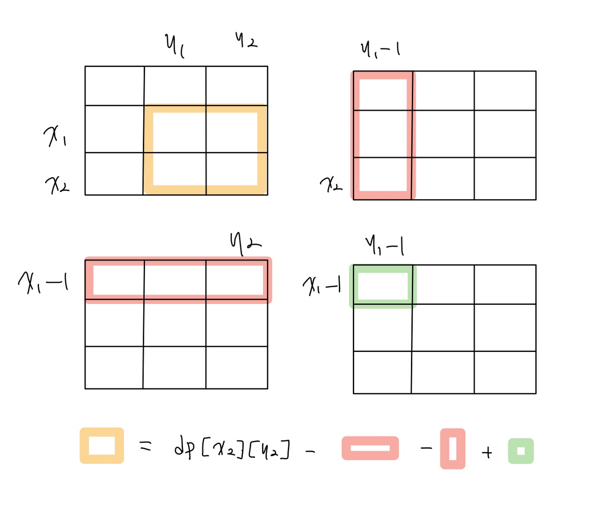

📌 [백준 11660 문제 링크](https://www.acmicpc.net/problem/11660) <br>

## 백준 11660 구간 합 구하기 5

(x1, y1)부터 (x2, y2)까지 합을 구하는 프로그램 작성하기

## 실패 코드

```python
# 11660 구간 합 구하기 5

# (x1, y1)부터 (x2, y2)까지 합을 구하는 프로그램 작성하기

import sys

input = sys.stdin.readline
n, m = map(int, input().split())
# m은 합을 구해야되는 횟수
grid = [[int(i) for i in input().split()] for _ in range(n)]
pos = []
for i in range(m):
    temp = [int(i) for i in input().split()]
    temp2 = []
    # 인덱스 0 ~ n - 1까지
    temp2.append((temp[0] - 1, temp[1] - 1))
    temp2.append((temp[2] - 1, temp[3] - 1))
    pos.append(temp2)

for i in range(m):
    row1, col1 = pos[i][0]
    row2, col2 = pos[i][1]
    sum = 0
    for j in range(row1, row2 + 1):
        for k in range(col1, col2 + 1):
            sum += grid[j][k]
    print(sum)
```

역시 `시간 초과` <br>

## 풀이 코드

```python
# 11660 구간 합 구하기 5

# (x1, y1)부터 (x2, y2)까지 합을 구하는 프로그램 작성하기

import sys

input = sys.stdin.readline
n, m = map(int, input().split())
# m은 합을 구해야되는 횟수
grid = [[int(i) for i in input().split()] for _ in range(n)]

accum_grid = [[0] * (n+1) for i in range(n+1)]
# 누적합 구하기
for i in range(1, n+1):
    for j in range(1, n+1):
        accum_grid[i][j] = accum_grid[i][j-1] + \
            accum_grid[i-1][j] - accum_grid[i-1][j-1] + grid[i-1][j-1]
        # print(accum_grid)

for k in range(m):
    row1, col1, row2, col2 = map(int, input().split())
    result = accum_grid[row2][col2] - accum_grid[row2][col1-1] - \
        accum_grid[row1-1][col2] + accum_grid[row1-1][col1-1]
    print(result)

```

## 코드 설명

📌 [참고 링크](https://sodehdt-ldkt.tistory.com/76) <br>

 <br>

뭐 이런 느낌으로 누적합을 사용한다고 한다. 아니 근데 코드가 짜기 어렵다기 보다는 에바야 ㅜㅜ 어케 생각하누
