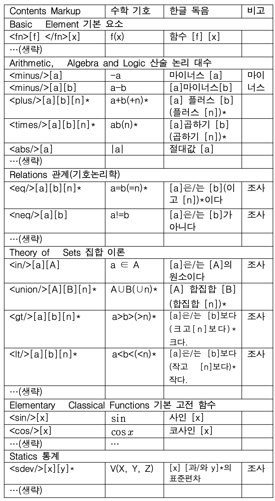
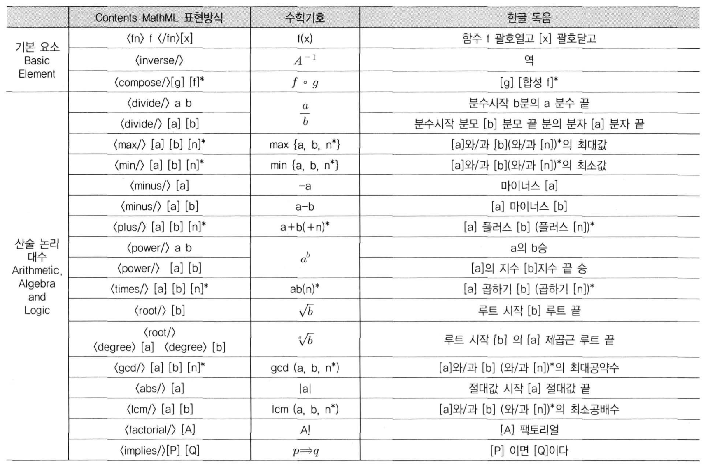

## 수학 수식에 대한 기존 방식

### [시각장애인이 어떻게 수학을?](https://www.imedialife.co.kr/news/articleView.html?idxno=14491)

- 시각장애인들은 대부분 암산으로 해결 -> 다만 행렬과 같이 숫자의 나열을 외우고 푸는데는 어려움이 있다. 오히려 미적분이나 인수분해 같은 문제의 경우 풀이과정의 연계성이 있어서 암산으로 풀어내는 것도 그닥,,, 어렵지 않다.

### [시각장애인의 눈과 귀가 되어주는 '씨(SEA)플랫폼'](https://m.blog.naver.com/etripr/221980116990)

- 수식/표 등과 같은 학습용 콘텐츠를 표현하기 위해 한국어에 특화된 독음 규칙을 만들었다.
- 변환도구: 기존 제작된 도서를 시각장애인이 이해할 수 있는 표준 전자책규약으로 변환한 기술
- 리더: 비장애인이 전자책을 읽기 위해 필요한 기능 + 시각장애인들도 해당 기능을 동일하게 사용할 수 있도록 TTS 출력 기능 이용
- 해당 플랫폼에서는 중학교 수준의 수식이나 표 등 전달 기술을 개발

### 선행연구

- The Reading Rule and Transformation of Mathmatical Expression in the Content MathML
    

- A Reading Technique of math expression ni e-Book for Reading-disabled People
    
    