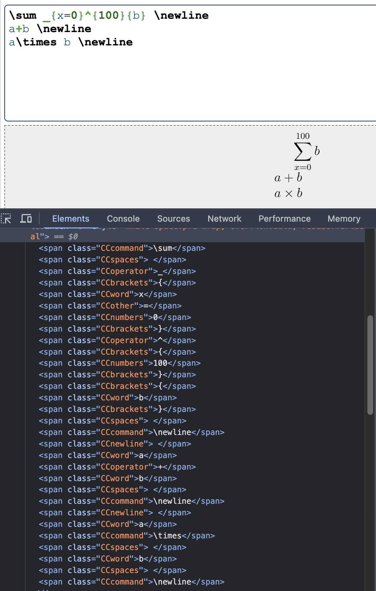

Latex 문법에 맞게 수식을 쪼개기가 너무 어려울 것 같다는 생각이 들어 어떻게 해야될지를 모르겠음.

- [LaTex for Beginners](https://www.colorado.edu/aps/sites/default/files/attached-files/latex_primer.pdf#:~:text=LATEX%20(pronounced%20lay%2Dtek),software%20for%20most%20operating%20systems.) 에서 6장 참고 
    - Although some basic mathematical symbols (+ - = ! / ( ) [ ] :) can be accessed
directly from the keyboard, most must be inserted using a command. -> \이 안쓰이는거는 저것밖에 없음! 그 이외에는 command로 사용한다고 한다. 

그러면 일단 내일 스택/큐를 사용해서 command(\ 시작 명령어), operator(+ - = ! / ( ) [ ] :) 와 그 외를 기준으로 휴위표기법을 사용해봐야될 것 같다... 

- 그 외, html 에서 LaTex 형식 입력 코드를 발견하여서 해당 코드에서는 LaTex를 어떻게 구분하였나 보니
 

태그 구분이 이렇게 되어있었다. 

## LaTex 태그 구분(내 시나리오)

- Command: \로 시작하는 "모든" 명령어(\left, \right)
    - 피연산자 0개: \ln, \log, \sin, \cos, \tan, \min, \max, ^\prime, +, -, \pm, \mp, \times, \div, /, =, \ne, \le, \leq, 
    - 피연산자 1개: \sqrt{}, _{}, ^{}, \mathrm{}
    - 피연산자 2개: \frac{} {}
    - 특이: \left\vert, \right\vert

- Operator: + - = ! / ( ) [ ] :
- space
- bracket: (), [], {}
- word: 문자
- numbers: 숫자