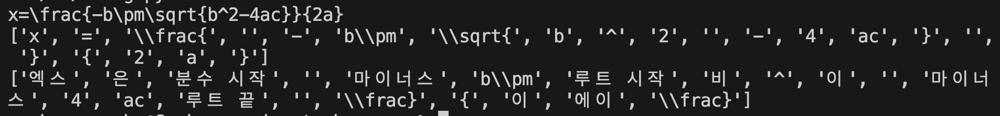

- re 사용, 스택 사용 -> 어찌저찌해서 이 정도까지는 구현 완료

## 불가능 범위

- 문자 + 연산자: b\\pm 이런 경우(얘도 문자+문자로 포함될 수 있음)
- 문자 + 문자: ac -> 분리가 되어야 문자 독음이 가능
- 분수
- ^{}, ^, _, _{}: 위첨자, 아래첨자는 변환된 수식과 어순이 다르기 때문에 어떻게 해야될지 모르겠음, 그리고 위첨자, 아래첨자 뒤에 중괄호가 있는 것도 있고 없는 것도 있어서,, ^, _가 있고 {가 없다는 것은 일단 수식 길이가 1이라는 것이므로 {}를 붙혀준다?

