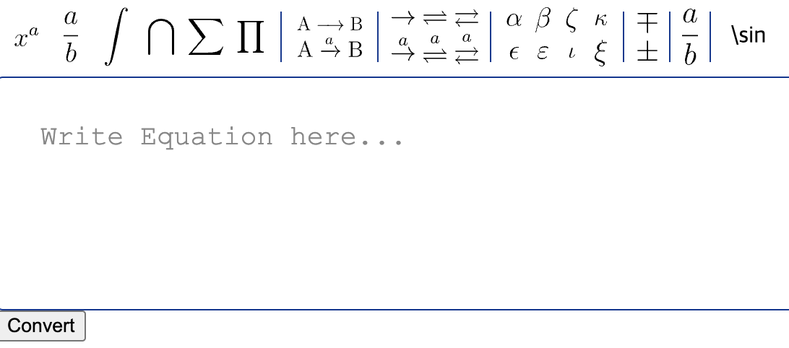

## 11일 미팅 대체 보고 내용

1. 기존 방식(Brute Force Algorithm) 결과 이미지

     

     

    - javascript로 개발 진행 중
    - 지난 주에 변환되지 않았던 분수, 위첨자, 문자 변환 완료

2. 추후 개발 진행 시의 확장성을 위해서 ***재귀 구조*** 로 Latex 수식을 변환 할 수 있는 방안 모색 -> 개발 진행 중
3. Latex Editor 확장 가능성 확인 중

## Latex Editor 확장성 확인

- Equation Editor 공식 문서를 확인해보면 확장은 가능! 
- 다만 확장을 하기 위한 연산자 정보들은 어디에 있는거지?

 

확장은 되지만 어떻게 latex 수식을 입력을 해야 보여주는 수식? 이 나오는건지,, 찾아봐야 됨. 

## To Do

🔲 연산자를 마음대로 배치할 수 있는 방법 

🔲 latex 수식 이미지 url 규칙 찾아보기 -> [Latex 수식 명령어 정리](https://strikers01.tistory.com/445)