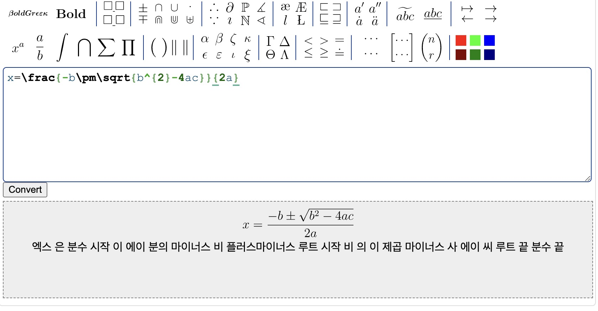
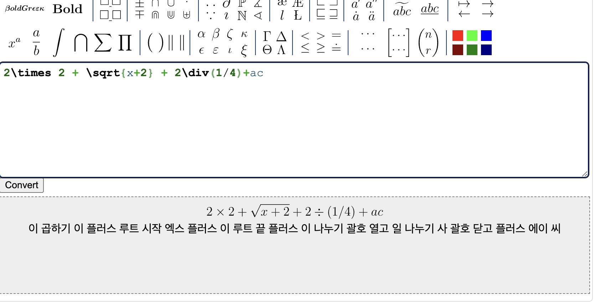

## 11일 미팅 대체 보고 내용

1. 기존 방식(Brute Force Algorithm) 결과 이미지

     

     

    - javascript로 개발 진행 중
    - 지난 주에 변환되지 않았던 분수, 위첨자, 문자 변환 완료

2. 추후 개발 진행 시의 확장성을 위해서 ***재귀 구조*** 로 Latex 수식을 변환 할 수 있는 방안 모색 -> 개발 진행 중
3. Latex Editor 확장 가능성 확인 중

## Latex Editor 확장성 확인