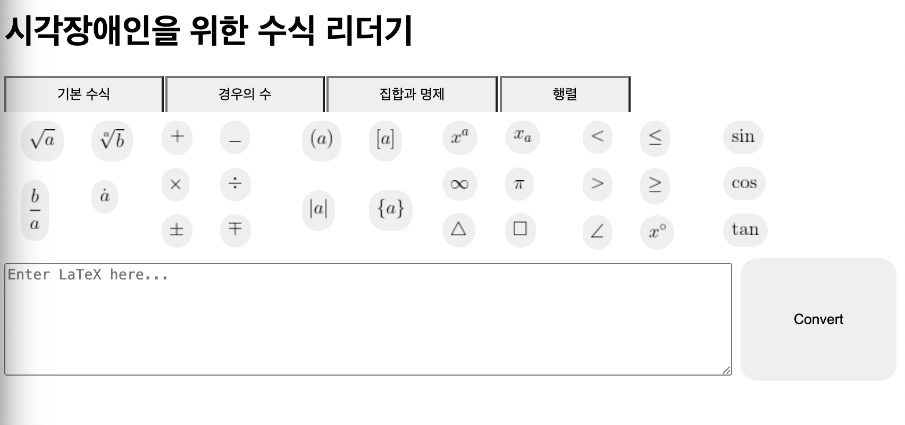
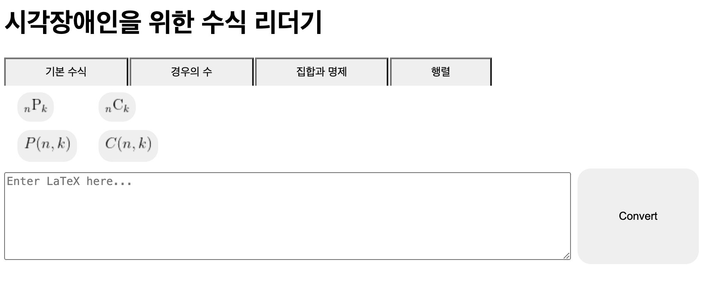
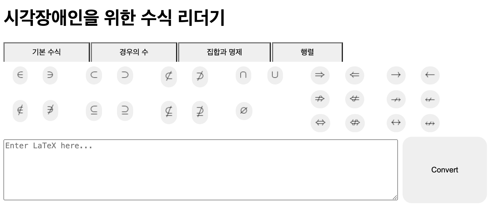
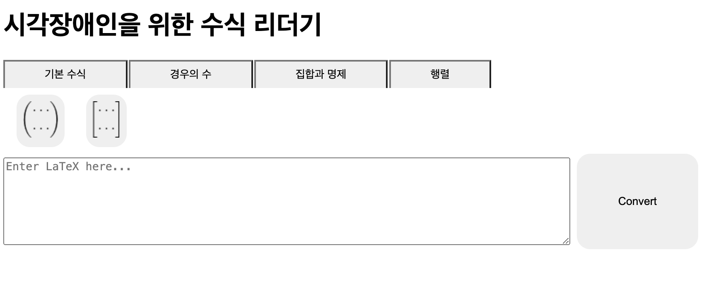
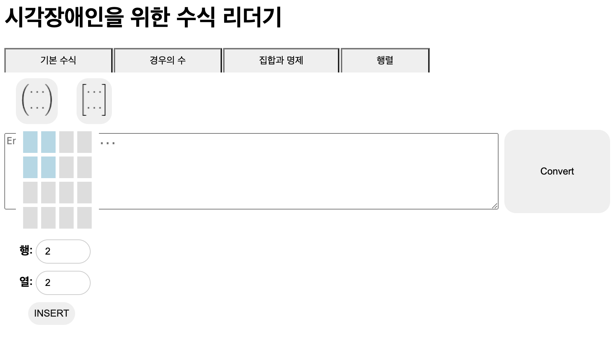

## 구현해야되는 모든 수식 버튼을 넣은 페이지 개발 완료

### 기본 수식
중등 수식을 넣음

### 경우의 수

### 집합과 명제

### 행렬

### 페이지 구현 설명

- pages/LatexEditor.js : 메인 페이지
- compoments/Standard.js : 기본 수식 컴포넌트(메인 페이지의 하위 컴포넌트)
- compoments/Cases.js : 기본 수식 컴포넌트(메인 페이지의 하위 컴포넌트)
- compoments/SetAndProp.js : 기본 수식 컴포넌트(메인 페이지의 하위 컴포넌트)
- compoments/Matrix.js : 기본 수식 컴포넌트(메인 페이지의 하위 컴포넌트)
- components/FormulaButton.js : 일단 수식 버튼 컴포넌트
- components/MatrixPopUpButton.js : 행렬의 경우 팝업을 띄워서 행과 열을 입력받은 후 textarea에 입력되어야하므로 기존 FormulaButton으로는 불가하여 새로 만든 버튼 컴포넌트
- utils/Data.js : 독음 규칙이 나와있는 딕셔너리
- utils/DivEquation.js : latex 수식을 한글로 변환해주는 API 이며 ** 추후 이 부분을 개발할 예정

### 추가 기능

- 커서 위치 조정: 입력이 필요한 첫 번째 부분에 커서를 두기

## DivEquation

- 현재 사칙연산, 분수, 루트, 괄호까지 독음 완료(@min02choi, @1004jumto 개발 담당)