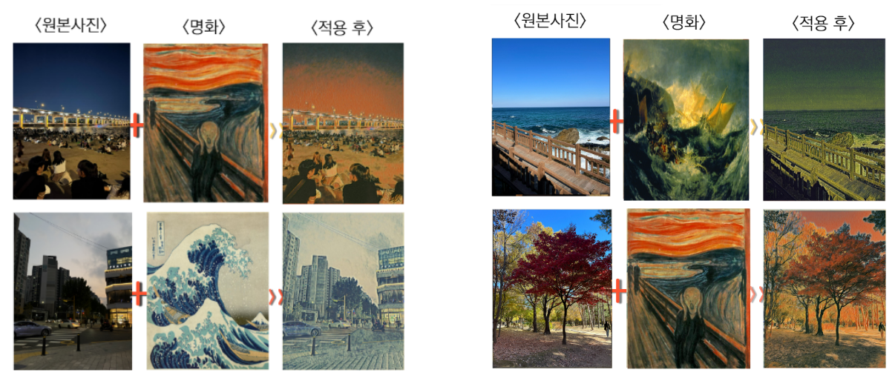

## 일상을 명화로!

## 1️⃣ Introduction

소셜 네트워크 서비스가 보편화되고 그 종류가 확장되면서, SNS에서의 사진은 카메라로 촬영한 후 업로드하는 단순한 사진의 개념을 넘어, 다양한 필터와 효과를 적용하여 개성 있는 하나의 작품을 만드는 창작물의 개념으로 확장되고 있다. 따라서 SNS를 이루는 주된 매개체인 시각적 자료들을 만들 수 있는 편집 애플리케이션 또한 인기가 증가하고 있다.  

그러나, 현존하는 많은 필터는 얼굴을 타겟팅으로 편집 및 미용에 목적을 두는 경우가 많다.  

본 프로젝트에서 개발하고자 한 애플리케이션은 다양한 스타일의 명화를 필터로 만들어 사진에 적용할 수 있는 애플리케이션으로, 사진의 배경에 집중하는 것이 특징이다.  

## 2️⃣ 개발환경 및 기술 스택

## 3️⃣ 주요 기능

### 명화 스타일 필터

애플리케이션 사용자가 마음에 드는 명화와 적용시킬 사진을 선택하면, 기계학습을 활용하여 해당 명화의 특징적인 스타일, 색감, 및 텍스처 등의 스타일을 사용자가 선택한 사진에 동적으로 적용하는 기능을 제공한다. 이를 통해 동일한 필터라도 선택한 명화의 특성을 반영하여 사용자 맞춤형으로 사진을 변환하며, 배경에 따라 최적화된 스타일을 적용하여 사진을 아름답게 표현할 수 있다.

### 소셜 네트워크 서비스

소셜 로그인 : 본 애플리케이션에서는 Google, Naver를 통한 로그인을 제공하고 있어, 사용자는 구글 혹은 네이버로 로그인하여 SNS 기능을 사용할 수 있고, 회원가입이 필수는 아니기 때문에 필터 앱으로의 기능은 그대로 사용 가능하다.
게시물 업로드 : 명화 필터를 적용한 사진을 설명과 함께 자신의 게시물로 업로드할 수 있으며, 다른 사용자들이 볼 수 있다. 타 SNS와 같이 자신의 페이지를 구성하는 배경사진, 프로필 사진, 게시물이 있으며 자유롭게 사진을 설정할 수 있다.
친구 검색 : 사용자는 아이디를 통해 다른 사용자를 검색할 수 있으며, 해당 사용자의 게시물을 볼 수 있다.

## 4️⃣ 구동 시나리오

[시연 영상 링크](https://www.youtube.com/watch?v=5wmFSTUlOio)  

### 1. 초기화면

### 2. 촬용이미지 및 기존이미지 변환

### 3. 변환된 이미지 저장 및 업로드

### 4. 구현 인스타 기타 기능(친구 검색/배경 및 아이디 변환)

## 5️⃣ 명화 필터 적용 예시

## ✨ Contributors

|     Name      | 손수경 |  이예진 | 최민영 | 윤소윤 |
| :-----------: | :----------------: | :----------------: | :------------: | :---------------: |
| **Github ID** |  [@sooking87](https://github.com/sooking87) |      [@1004Jumto](https://github.com/1004Jumto)     |   [@min02choi](https://github.com/min02choi)   |  [@kingwhangzang](https://github.com/kingwhangzang)   | 
| **Position**  | ML Developer  |   Frontend Developer|  Backend Developer  | Dev Project Manager |

## 후기

우선 GPU를 사용하여 프로젝트를 해본 경험이 이번이 처음이었다. GPU 인스턴스를 사용하기 위해서 다양한 시도를 해보았지만 결국 코랩 + FastAPI + Cloud Function Trigger을 사용하여 배포를 진행하였다.  

아쉬운 점은 수상을 못한 점... 이었다. 기존에 작성하였던 계획 + 아키텍처에 맞게 완성도 있게 진행하였다고 생각을 하였지만, 개발에 초점을 둔 대회가 아니였던 점 + 주제 자체가 가볍게 보일 수 있다는 점 등의 이유로 수상을 하지 못한 것 같다.  

하지만 이번 프로젝트를 통해서 어떤 식으로 GPU 사용 모델을 배포할 수 있는지 배웠으므로 타대회나 졸업 프로젝트에서 유사하게 사용하면 될 것 같다!