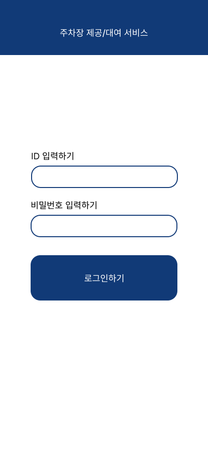
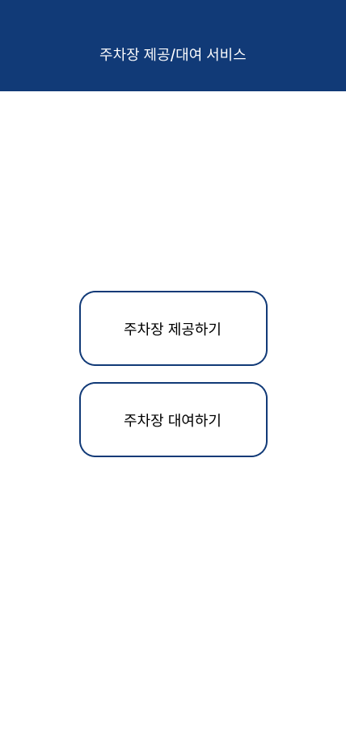
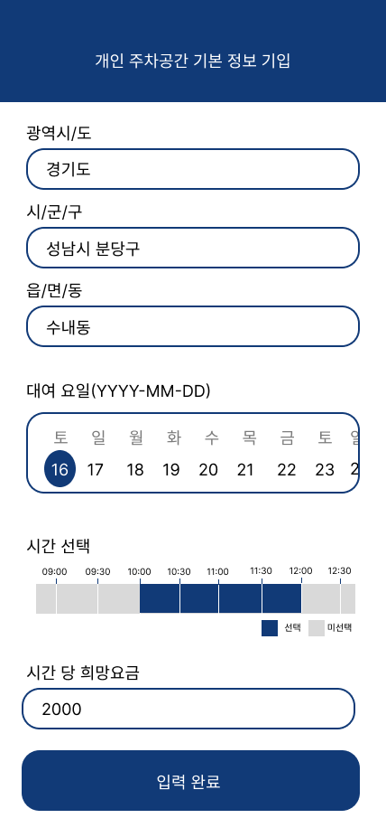
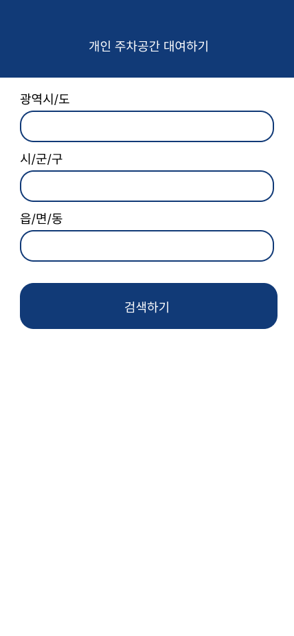
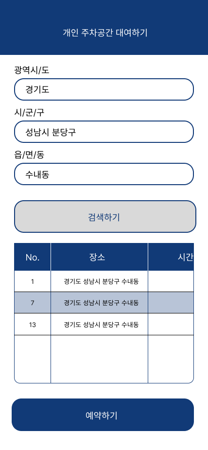

## 1️⃣ 주제 선정 및 배경

  
서울, 경기도, 인천과 같은 대도시는 주차 공간 부족 문제로 심각한 교통 혼잡 및 주차 어려움을 겪고 있습니다. 이 문제는 일상 생활에 불편을 초래하고, 더 나아가 시간과 에너지 낭비로 이어집니다. 현재 주차 정책이나 공공 주차장, 공동 주차 공간 대여 등의 서비스가 진행되고 있지만 이러한 문제를 완전히 해결하지 못하고, 더 나은 대안이 필요하다고 느꼈습니다. 이러한 문제의 해결을 위해서 저희팀은 개인 주차 공간 대여 서비스를 제안합니다. 

## 2️⃣ 서비스 내용

  

각 건물/주거 공간에 따라 개인 주차 공간이 제공되는 경우가 많습니다. 일반적으로 개인 주차 공간의 경우, 주인의 이동을 통해서 주차 공간이 비어있을 때에는 주차금지 라바콘을 이용하여 사용 금지를 표시합니다.  
저희 서비스에서는, 개인 주차 공간 소유자가 빈 주차 공간을 등록합니다. 주차장의 경우, 직비를 사용하여 주차 공간이 비었는지 아닌지를 판단할 수 있습니다. 이때 소유자는 주차 공간이 비어있는 시간, 시간 당 요금을 선택하여 공간을 등록합니다. 이용자는 주차 공간을 탐색하고, 필요할 때 예약하여 특정 시간 동안 주차 공간을 사용할 수 있습니다. 이용자가 주차 공간을 예약하면, 주차 공간 소유자는 예약 내역을 조회하고, 결제를 확인할 수 있습니다.  

***NIC***(Network Interface Card)를 통해서 디바이스는 주차장 대여 시스템과 통신하고 주차 가능 상태 정보를 주고 받을 수 있습니다. 주차 공간을 제공하고자 하는 유저(User1), 주차 공간을 대여하고자 하는 유저(User2)로 크게 나눌 수 있습니다.  
***User1***: User1의 주차공간에 차가 주차되어 있는지는 NIC를 통해 감지합니다. User1은 주차공간의 위치, 자신이 주차장을 사용하지 않는 시간, 시간당 요금 등의 정보를 소비자에게 알립니다.  
***User2***: 주차 공간 이용 희망에 대한 데이터를 주차장 대여 시스템에 전송합니다.

## 3️⃣ 서비스 SAN

  

사용자와 제공자 모두 거리, 차 안, 집 사무실 등 공간에 구애받지 않고, 서비스를 이용할 수 있도록 WAN으로 묶어 인터넷에 연결하는 방식으로 구성하였습니다.  

NIC를 통해 각 주차장의 주차 공간에 차가 주차 되었는지를 확인합니다. NIC 정보들은 802.15.4인 직비 프로토콜을 통해 gateway로 전달된 뒤, 802.3인 유선 프로토콜로 바뀌어서 Hub로 전달됩니다. 또한, Hub에 AP를 연결하여 802.11.ax 프로토콜을 통해 일반 사용자들의 무선 네트워크 이용 편의성을 돕습니다. 그 후 각 Hub 들은 Switch로 모입니다. 802.3 유선 프로토콜을 사용해 백본 연결에 이용합니다. 이때, 한 에리어 내에서 네트워크가 구축되는 것이 아닌, 인터넷까지 나아가야 하는 시스템이라, 라우팅 기능을 가지고 있는 L3 스위치를 사용하였습니다.  
L3 스위치를 통해 전달된 데이터는 Router와 Backbone을 거쳐 클라우드 서버에 정보가 저장이 됩니다. 이 정보를 바탕으로 주차 공간을 대여하고자 하는 사용자는 사용 여부의 데이터를 클라우드 서버로 전달하게 됩니다.  

클라우드를 사용하는 경우, 클라우드와의 연결, 네트워크, 물리적 장치와 위치, 구동은 모두 클라우드 제공자가 상품으로써 판매하는 것을 사용하는 것이므로, L2 스위치를 삭제하고 하나로 묶어 표현하였습니다.  
추가로 클라우드에는 모바일 애플리케이션 서버, 데이터베이스 서버, 인증서버, 결제 서버, 보안 서버 등의 서버들도 포함되어 있습니다.

## 4️⃣ 서비스 소개

### 1. 초기 화면

### 2. 주차 공간 제공자/대여자 선택

### 2-1. 주차 공간 제공자 선택 시

  

주차 공간을 제공하고자 하는 주차장 위치, 사용가능 시간, 시간 당 요금을 서버로 전송합니다. 

### 2-2. 주차 공간 대여자 선택 시

  

주차장 위치 검색 후 대여하고자 하는 위치를 예약합니다.

## 소캣 프로그래밍 사용하여 Server-Client 통신

  

- src/client/FinPanel.java: 서비스 이용 완료 후 나오는 패널
- src/client/MainUI.java: 서비스 이용 시 메인 페이지 프레임
- src/client/Provider.java: 서비스 이용 시 개인 주차 공간 제공자가 이용하는 페이지로 주차 대여 공간, 가용 시간, 시간 당 요금을 입력할 수 있는 패널
- src/client/Renter.java: 서비스 이용 시 개인 주차 공간 대여자가 이용하는 페이지로 대여하고자 하는 주차 공간을 검색하여 선택하고 예약할 수 있는 패널
- src/client/StartUI.java: 서비스 이용 전 유저의 ID 입력을 하는 프레임
- src/server/Server.java
- src/server/

### DB 설명

  

## 서비스 기대 효과

  

## ✨ Contributors

|     Name      | 문수정 |  손수경 | 이예진 | 윤소윤 | 최민영 |
| :-----------: | :----------------: | :----------------: | :------------: | :---------------: | :---------------: |
| 담당 파트 |  네트워크 자료 조사/SAN 구상 및 발표자료 제작 |      소캣 프로그래밍 - UI 구성 및 개발    |   네트워크 자료 조사/SAN 구상 및 발표자료 제작   |  네트워크 자료 조사/SAN 구상  |  소캣 프로그래밍 - DB 설계 및 개발      | 