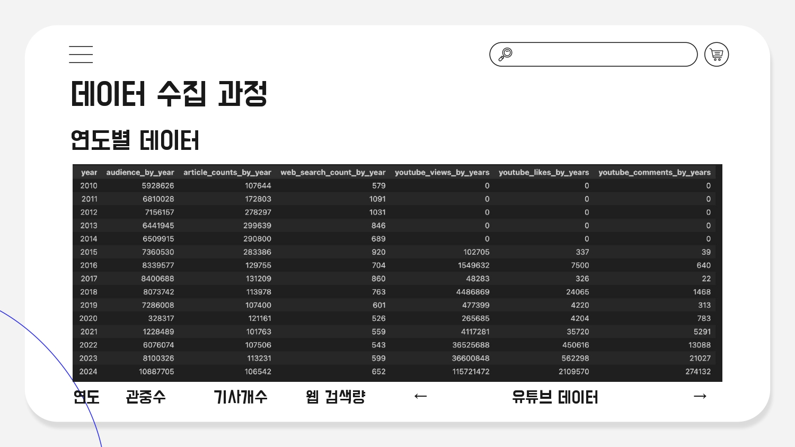
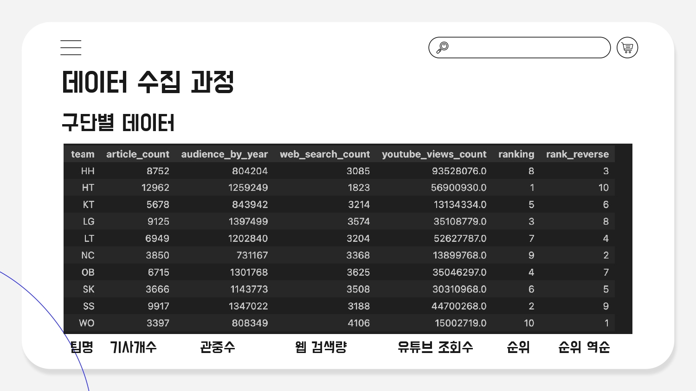
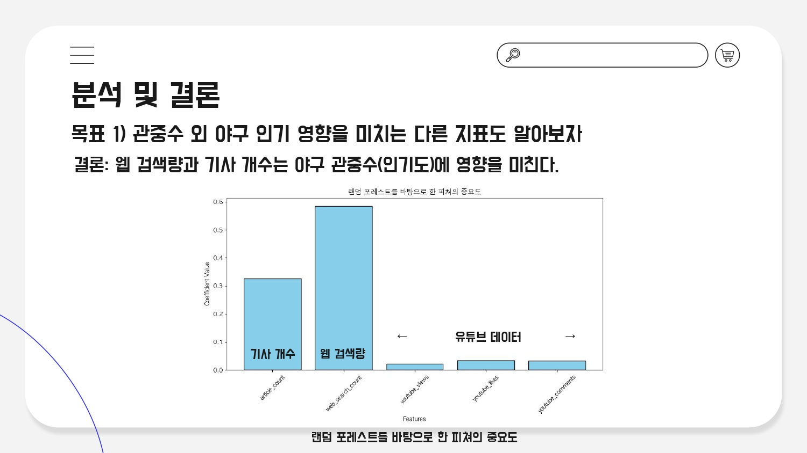
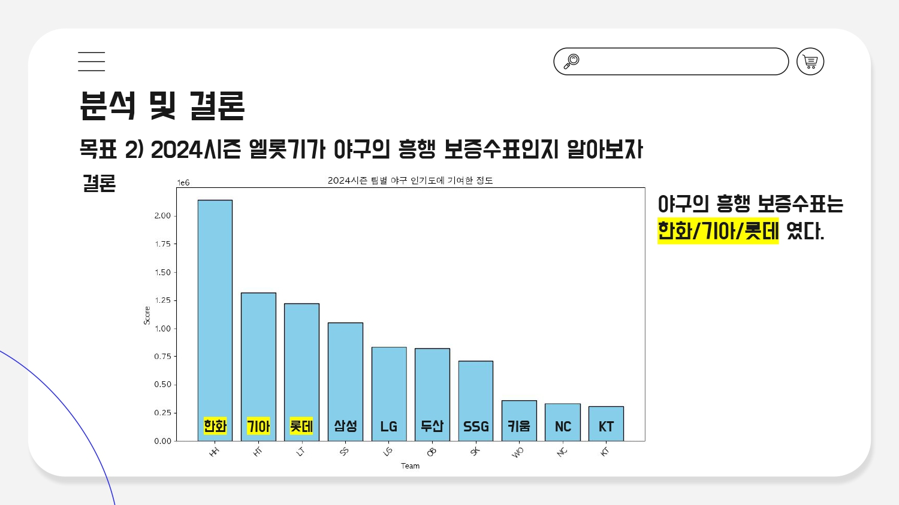

## Abstract 

본 연구는 한국 프로야구(KBO)의 대중적 인기도를 다양한 지표를 통해 수치화하고 구단별 기여도를 평가하고자 합니다. 야구의 인기도 평가를 관중 수 외 웹 검색량, 기사 개수, 유튜브 데이터와 같은 디지털 데이터를 활용하여 새로운 접근 방식을 제안합니다. 연구 결과, 웹 검색량과 기사 개수가 관중 수에 영향을 미치는 것으로 나왔으며 2024년에는 한화, 기아, 롯데 구단이 야구 흥행에 가장 크게 기여한 것으로 나타났습니다.

## Introduction

올해 한국 프로야구(KBO)의 인기가 많이 증가하면서 "역대급 KBO 인기"라는 평가를 받고 있습니다. 하지만 "역대급"이라는 표현이 정확히 어떤 지표에 근거한 것인지에 대한 궁금증이 생겨, 본 연구를 진행하게 되었습니다. 관중 수는 중요한 지표이지만 디지털 시대에는 웹 검색량, 기사 개수, 유튜브 조회수 등도 대중적 관심도를 반영하는 주요 요소가 될 수 있습니다. 본 프로젝트에서는 2010년대 이후 야구 인기도를 평가할 수 있는 웹 검색량, 기사 개수, 유튜브 조회수를 바탕으로 KBO의 대중적 인기를 수치화하고자 합니다. 특히, 인기도를 직접적으로 반영할 수 있다고 판단되는 관중 수를 주요 수치화 지표로 간주하여, 다른 지표들과의 관계를 탐구하였습니다. 또한 관중 수 외 다른 지표들의 가중치 결괏값을 바탕으로  지표들을 결합해 구단별 흥행 기여도를 구체적으로 분석하였습니다.

## Progress

### 1️⃣ 데이터 수집 과정

프로야구의 대중적 인기도를 평가하기 위해 2010년부터 2024년까지의 인기 관련 데이터를 수집했습니다. 관중 수를 탐색하기 위해 KBO 웹사이트(https://www.koreabaseball.com/Default.aspx )에서 연도별 관중 수 데이터를 수집했습니다. 웹 검색량은 Google Trends를 이용하여 데이터를 수집하였습니다. 파이썬의 pytrends 라이브러리를 활용하여 “야구”, “KBO”, “야구장”, “프로야구” 검색어를 사용했습니다. 기사 개수는 네이버 스포츠 기사(https://sports.news.naver.com/kbaseball/news/index?isphoto=N&view=photo )를 통해 웹 크롤링을 진행하였습니다. 유튜브 데이터는 깃허브 youtube_scraper(https://github.com/Gilhwan/youtube_scraper )를 통해서 유튜브 데이터를 수집하였습니다. 수집한 유튜브 채널명은 “KBO”입니다.  

  
2024시즌 구단별 야구 인기도의 기여 정도를 분석하기 위해서 2024년 구단별 데이터를 수집했습니다. 2024년 구단별 관중 수는 KBO 웹사이트(https://www.koreabaseball.com/Record/Crowd/GraphTeam.aspx )에서 수집하였습니다. 웹 검색량은 Google Trends를 이용하여 구단명을 검색어로 사용하여 데이터를 수집하였습니다.  
유튜브 데이터는 youtube_scraper(https://github.com/Gilhwan/youtube_scraper )를 통해서 유튜브 데이터를 수집하였습니다. 유튜브 데이터의 경우 조회수, 좋아요수, 댓글 수 데이터를 수집하였습니다.  
  

### 2️⃣ 데이터 분석 및 결과

- 야구 인기도의 지표 분석

야구의 인기도는 관중 수로 수치화되었다고 가정하고, 웹 검색량, 기사 개수, 유튜브 데이터를 독립 변수로 활용하여 랜덤 포레스트를 적용했습니다. 랜덤 포레스트를 선택한 이유는 수집한 데이터들이 관중 수와 선형적인 관계를 가지지 않으며, 정규성을 가지고 있지 않기 때문입니다. 독립 변수들은 랜덤 포레스트의 feature_importances_ 로 변수별 가중치를 지정하였습니다.  
분석 결과, 웹 검색량과 기사 개수가 관중 수에 가장 큰 영향을 미치는 변수로 나타났으며, 유튜브 데이터는 상대적으로 낮은 중요도를 보였습니다. 각 변수의 중요도는 아래 그림과 같습니다.  

  

- 구단별 흥행 기여도 분석

2024년 데이터를 기반으로 각 구단의 흥행 기여도를 산출했습니다. 흥행 기여도를 산출한 과정은 다음과 같습니다.
score = (web_search_count  w1)  (article_count  w2)  (youtube_likes  w3)  (youtube_comments  w4)  (youtube_views  w5)

기여도 분석을 하기 위해서 구한 가중치의 경우 야구 인기도 지표 분석을 통해서 구한 가중치를 사용하였으며, 구단별 흥행 기여도 분석을 위해서는 구단별 관중 수와 흥행 기여도 점수와는 무관합니다. 
한화, 기아, 롯데가 가장 높은 점수가 나왔으며 2024시즌 동안 야구 흥행에 가장 크게 기여했음을 보여줍니다. 그 외 10개 구단에 대한 야구 인기도에 기여한 정도는 아래 그림과 같습니다.  

  

## Result

본 연구는 관중 수뿐만 아니라 웹 검색량, 기사 개수와 같은 디지털 데이터를 활용하여 야구의 대중적 인기를 보다 정교하게 평가할 수 있음을 보였습니다. 이는 관중 수만으로는 파악할 수 없는 온라인상의 대중적 관심도를 구체적으로 확인할 수 있다는 점에서 중요한 의미를 가집니다. 또한 2024년 한화, 기아, 롯데 구단이 야구 흥행에 가장 크게 기여한 것으로 나타났습니다.  
이러한 결과는 구단별 마케팅 전략 수립과 방송 편성 계획 등 여러 분야에서 실질적으로 활용될 가능성을 시사합니다. 특히, 높은 기여도를 보인 구단을 중심으로 한 콘텐츠 제작, 광고 기획과 방송 편성, 스폰서십 우선순위 결정에 유용한 참고 자료로 활용될 수 있을 것입니다. 

## Limitation

본 연구에서는 야구 인기도를 평가하기 위한 다양한 지표를 활용했지만, 일부 데이터의 부족으로 인해 분석에 제한이 있었습니다. 예를 들어, 방송 시청률, 인스타그램 데이터, 팬카페 회원 수, 유니폼 및 굿즈 판매량 등 인기도를 나타낼 수 있는 추가적인 지표를 포함하지 못했습니다. 또한, 데이터를 연도별로 수집했기 때문에 표본 크기가 15개에 불과해 분석 과정에서 통계적 한계가 있었습니다. 특히, 2010년부터 2024년까지의 월별 관중 수 데이터가 없었고, 기사 개수 데이터의 수집에도 시간이 많이 소요되어 연도별 데이터로 분석을 진행할 수밖에 없었습니다. 이러한 표본 수의 부족은 결과의 신뢰도에 영향을 미칠 수 있습니다.   
Granger 인과관계 분석 결과, 관중 수가 독립변수들과 비례한다고 가정했을 때 모든 변수가 유의미하지 않다는 결론이 도출되었습니다. 그럼에도 불구하고, 2024년 구단별 데이터를 기반으로 한 분석에서는 KT, SSG, 롯데, NC 구단의 웹 검색량이 관중 수 예측에 유의미한 정보를 제공한다는 결과가 나타났습니다. 반대로, 웹 검색량을 종속변수로 설정하고 관중 수를 독립변수로 설정했을 때, KT와 NC 구단의 P-값이 유의미하게 도출되어 두 변수 간 상호작용이 존재함을 확인했습니다.   
이러한 상황에서도 본 연구는 관중 수를 종속변수로 설정했는데, 이는 네이버 스포츠 기사에서 관중 수를 주요한 인기도 판단 기준으로 사용했기 때문입니다.

## [Github Link](https://github.com/sooking87/Statistical-Analysis-Practice/tree/master/%EA%B8%B0%EB%A7%90%EB%B0%9C%ED%91%9C) 🔗

- 기말발표/baseball_popularity_by_years.csv: 연도별 데이터
    - year
    - audience_by_year(연도별 관중수)
    - article_counts_by_year(연도별 기사 개수)
    - web_search_count_by_year(연도별 웹 검색량)
    - youtube_views_by_years/youtube_likes_by_years/youtube_comments_by_years(유튜브 데이터)
- 기말발표/2024_rank_by_teams_baseball_popularity.csv: 구단별 데이터
- 기말발표/data_analysis_final.ipynb: 데이터 분석 및 결과
