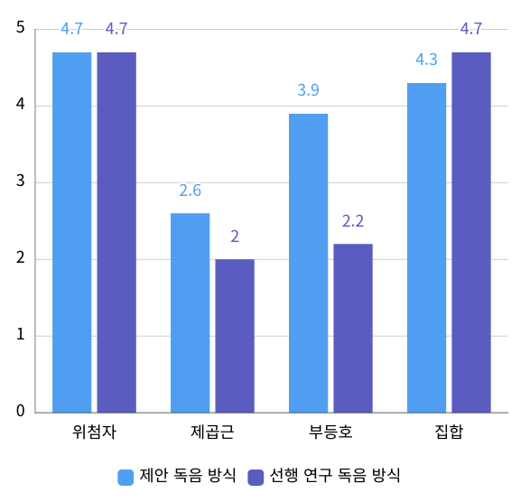

## Abstract

기존에 수학 연산자에 대한 독음 규칙은 정의되어 있으나, 대체 자료를 제작하기 위해 관련 내용을 개별적으로 찾는 과정은 시간이 많이 소요되고 비효율적이다. 이에 본 논문에서는 효율적인 대체 자료 제작을 위한 수식 음성변환 서비스를 구현한다. 본 서비스에서는 사용자가 입력하는 수식을 LaTeX 형식으로 제한하며, 이를 한글 독음 규칙에 맞게 변환한다. 이를 위해, 글로벌 표준인 MathSpeak 규격을 접목하여 한글화를 진행하고, 최신 2022 수학과 개정 교육과정을 기반으로 MathSpeak™ Core Specification Grammar Rules와 국립중앙도서관 2019 수학 독음 규정 v1.0 등을 분석하여 시각장애인에게 수식을 효율적으로 전달할 수 있는 방안을 구현하였다. 또한, 기존 독음 규칙에서 시각장애인의 수식 이해도를 높일 수 있는 개선 방안을 고안하여, 이를 통해 수식의 복잡성을 줄이고 직관적인 독음을 제공한다. 결론적으로 LaTeX 형식으로 입력받은 수식을 한글로 변환하여 시각장애인들에게 보다 효율적인 수식 학습 환경을 제공한다.

## Algorithm : DFS

LaTeX 문법에 따라 수식을 파싱한 후 각 항목을 분류하였다. 이 과정에서 수식을 재귀적으로  최소 단위까지 분리하는 방식을 사용하였는데, 최소 단위란 연산자 및 기호와 한글이 일대일 매칭이 가능한 상태를 의미한다. 재귀적인 분리 방식을 통해 한 연산자 안에 포함된 다른 연산자를 명확히 구분할 수 있으며, 이는 수식의 구조와 의미를 정확히 파악하기 위해 필수적이다. 이렇게 최소 단위로 분리된 수식은 트리 구조로 구성되며, 가장 내부에 위치한 항목부터 수식/연산자-한국어 일대일 매칭으로 통해 수식을 한글로 변환하여 음성 출력을 가능하게 한다.  

  

예를 들어, 수식 $\sqrt{b^{2}-4ac}$ 의 경우 최상위 연산자인 $\sqrt{}$를 기준으로 루트 안의 내용을 분석해야 한다. 이때 루트 내부의 수식 ${b^{2}-4ac}$는 중괄호 {}를 통해 구분되며, $-$ 연산자 중심으로 $b^{2}$와 $4ac$를 분리한다. 내부에 포함된 $b^{2}$는 $b$와 $2$로 분리하여 거듭제곱 연산임을 판단한다. 이러한 재귀적 분리를 통해 수식의 구조를 파악하여, '루트시작 비의 제곱, 마이너스 사 에이 씨'와 같이 독음할 수 있게 한다.

## Result

본 연구에서 제안한 수식 유형인 부등호, 제곱근, 무한소수, 행렬의 독음 방식이 기존 방식에 비해 더 직관적이며 명확한 독음을 제공할 수 있다는 가능성을 확인했다. 또한, 부등식을 독음하는 과정에서 의미 중심적 읽기 방식보다는 형태 중심적 읽기 방식을 채택하는 것이 이해도가 월등히 높았다. 특히, 무한소수와 행렬과 같이 사전에 정의되지 않은 수식에 대한 독음 규칙을 새롭게 정의하고 이해도 평가를 통해 성능향상을 확인할 수 있었다. 무한소수의 경우, 반복되는 구조를 설명할 때 발생하는 혼동을 줄이기 위해 명확한 표현과 규칙을 적용하였으며, 행렬은 ‘행렬 시작’과 같은 사전 안내를 통해 수식의 구조와 맥락을 더 쉽게 이해할 수 있도록 설계하였다.

전반적으로 복잡한 수식일수록 사전 설명을 제공한 후 독음하는 방식이 맥락 이해를 높이는 데 매우 효과적이었으며, 수식이 길어질수록 참여자들의 이해도가 감소한다는 사실을 확인할 수 있었다. 또한 수식의 간략 버전과 상세 버전의 수식의 길이나 상황에 따라 이해도가 달라짐을 확인할 수 있었다. 마지막으로, 발음 명료성 또한 중요한 요소로, 이를 개선함으로써 보다 효율적인 수식 독음 시스템을 개발할 수 있을 것이라는 결론에 도달하였다.

결론적으로 제안 독음 규칙에 대해 전반적으로 긍정적인 결과를 얻었다. 다만, 제곱근의 경우 독음 규칙에 ‘제곱근’을 넣기보다는 ‘승’을 사용하는 것이 좋겠다는 피드백과 시각장애인의 행렬 청음 방식을 토대로 독음 규칙을 수정하였다.

### 1차 정상 시력자 대상 테스트 결과

  

### 2차 시각장애인 대상 테스트 결과

  

## Contributors

|     Name               |                    Sohn SooKyoung                     |               Choi MinYoung               |              Lee Yejin              |
| :-----------: | :----------------------------------------------: | :----------------------------------------: | :----------------------------------: |
| **Github ID** |  [@sooking87](https://github.com/sooking87) | [@min02choi](https://github.com/min02choi) | [@1004Jumto](https://github.com/1004Jumto) |
| **Position**  |           주제 기획, 화면 개발, 부등호/경우의 수/집합과 명제 API 설계           |                주제 기획, DFS 기반 초기 API 설계 및 기본 수식 API 설계                 |                무한소수/행렬 API 설계                |     
