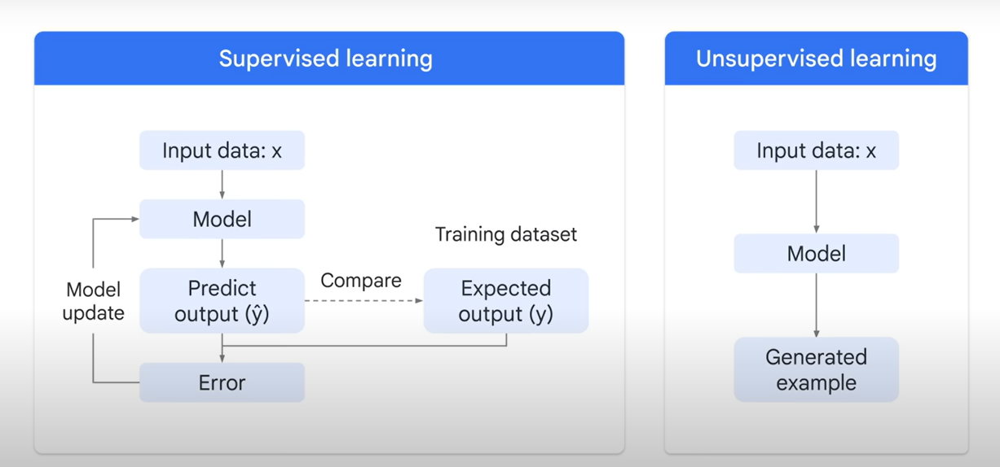
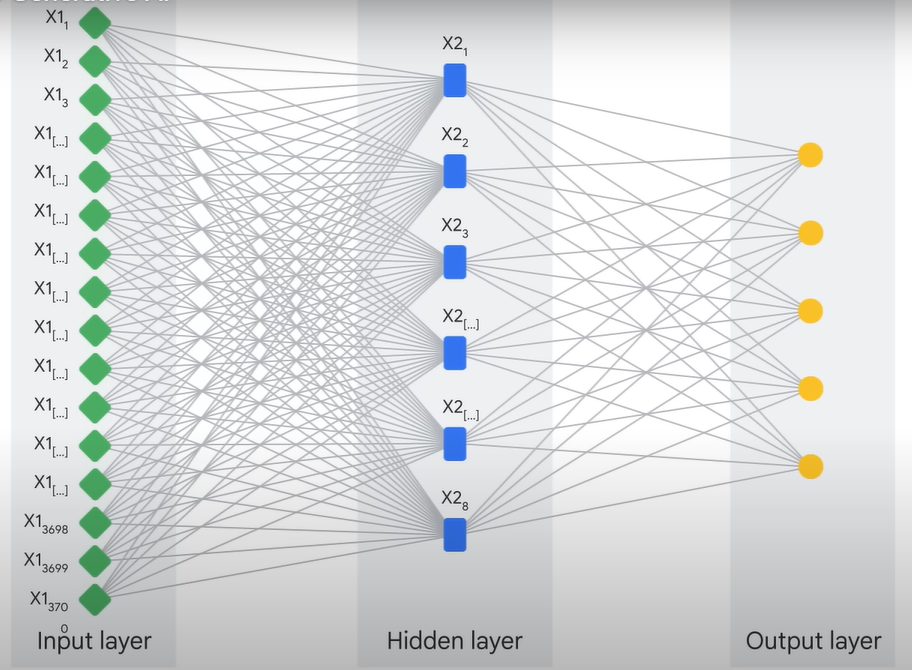
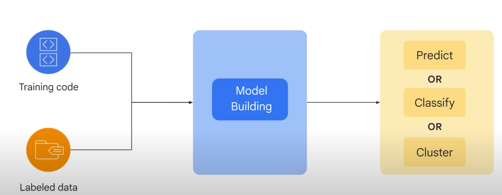
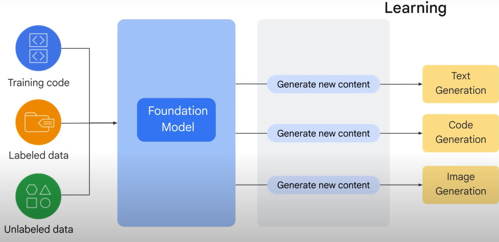

## ML

- 지도 학습 / 비지도 학습으로 나뉜다.

## DL

- 레이어로 구성

## AI의 분류

- discriminative -> 분류를 한다.(개인지 고양이인지)
- generative -> 해당 점에 대해서 joint probablilty distribution을 공부하고, 예측하고, 생성한다.

## GenAI Model

- unstructured content -> input -> GenAI -> output  

GenAI가 아닌 경우의 output -> Number, Discrete, Class, Probability  

GenAI인 경우의 output -> Natural Language, Image, Audio  

  

  

GenAI는 AI의 종류중 하나로, 학습했던 내용을 바탕으로 새로운 내용을 생성한다.  
GenAI로는 output의 종류에 따라 나뉘는데, text를 output으로 하는 경우는 LLM이라고 한다. LLM은 학습한 결과를 바탕으로 새로운 text를 생성한다. 
image를 output으로 하는 경우는 image를 input으로 가지며 text(captioning, answering, image search), image(super resolution, image completion), video(animation)을 output으로 가진다. 

## transformers -> GenAI

- transformers -> encoder(encode input sequence) + deconder(learns how to decode the representation)

## GenAI Model Type

- text-to-text: learn mapping between a pair of text
- text-to-image: captioned with a short text description된 이미지를 학습 -> diffusion이 하나의 방법
- text-to-video/text-to-3D: text를 기반으로 video/3D 생성
- text-to-task: trained to perform a defined task(쉽게 말해서 pretrained 모델)