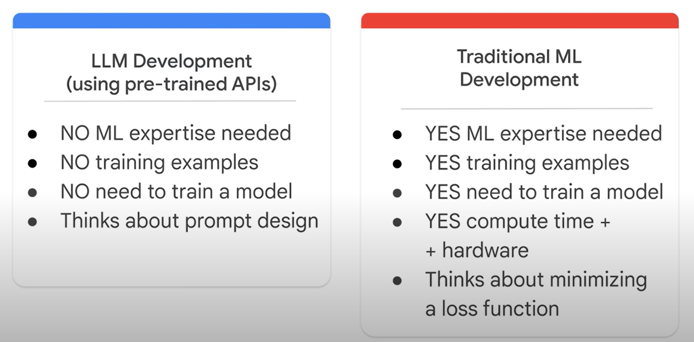

## What is LLM?

Large, general-purpose language models can be pre-trained and then fine-tuned for specific purposes 

### pre-trained & fine-tuned

일반적인 pre-trained된 모델의 경우는 강아지를 훈련시키는 것을 예로 들자면  
앉기, 뛰기, 오기, 기다리기를 훈련한다.  

하지만 여기서 경찰견, 탐지견 등은 그 외의 특별 학습이 필요하다.  

LLM의 일반적인 모델은 Text Classification, Question answering, Document summarization, Text generation이 가능하다.(pre-trained)  

여기에 해당 도메인에서 요구하는 특별 학습이 필요하다.(fine-tuned)

### Large

- large training dataset
- large number of parameters

### General purpose

- Commonality of human languages
- Resource restriction

## ex. PaLM

- Pathways는 새로운 아키텍쳐이며 transformers를 포함하고 있다. 

## pre-trained LLM vs Traditional ML

## Generical language model

- predict the next word based on the language in the training data

## Instruction Tuned language model

- trained to predict a response to the instructions(ex.특정 단어에 대해서 긍정인지 부정인지 판단.)

## Dialog Tuned language model

- trained to have a dialog by predicting the next response(ex. chain of thought reasoning)