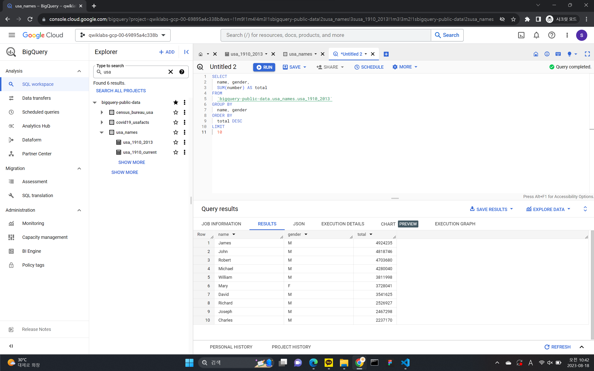
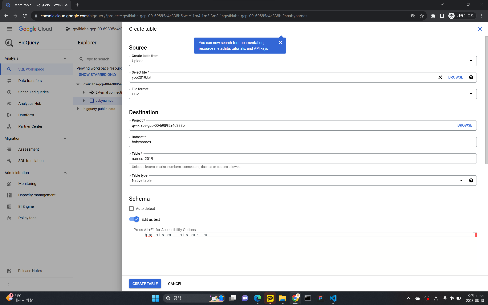
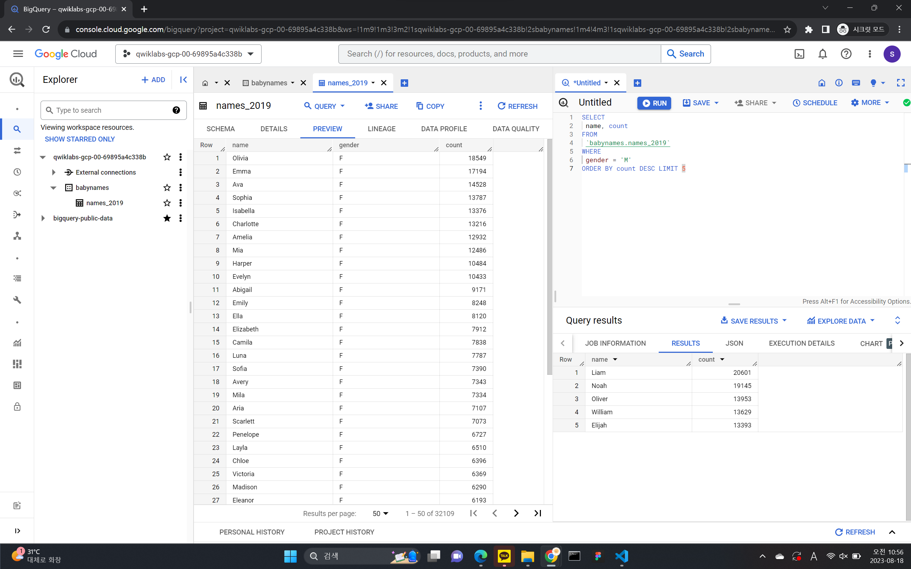
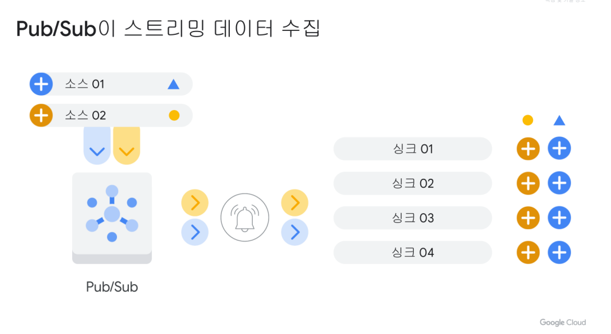
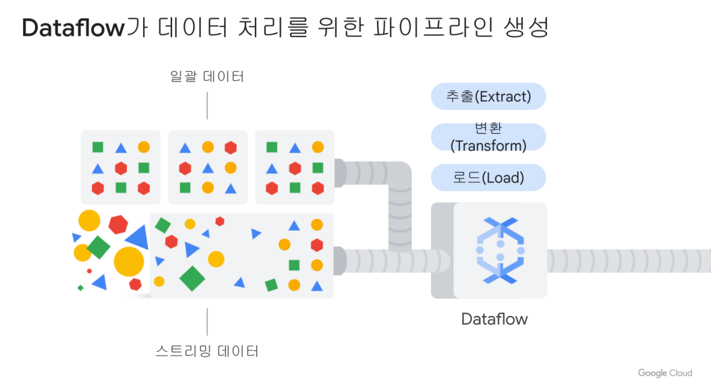
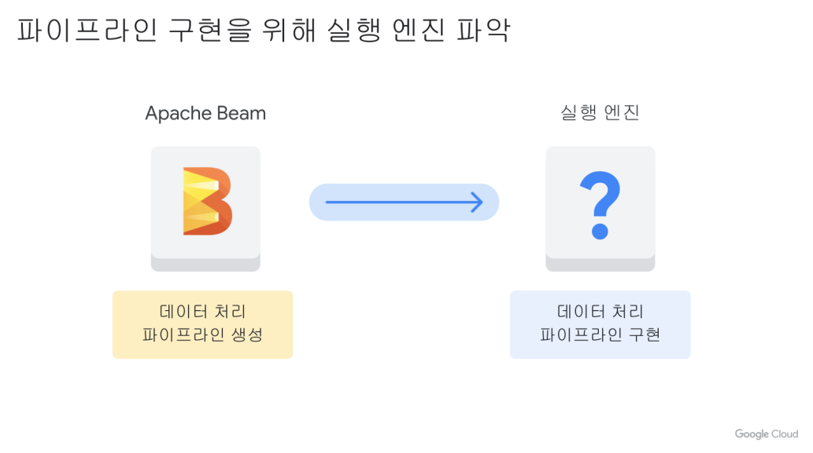
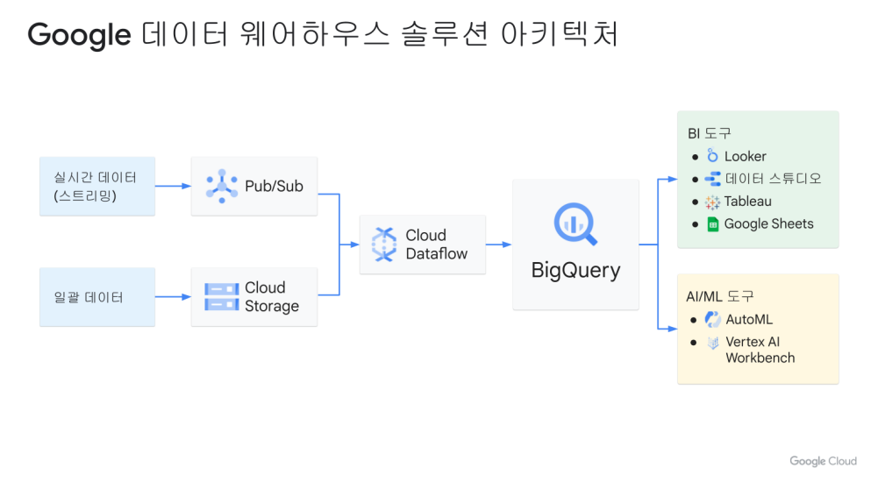

## Bigquery 실습

테이블을 생성 후 SQL을 활용해서 데이터에 접근하는 방식

### 공개 데이터 세트 쿼리하기

1. 왼쪽 창에서 데이터 추가 > 프로젝트 고정을 클릭합니다.
2. 프로젝트 이름 입력을 클릭합니다.
3. bigquery-public-data라고 입력하고 고정을 클릭합니다.
4. 고정된 프로젝트 목록에서 bigquery-public-data를 클릭하여 펼칩니다.
5. 공개 데이터 세트 목록을 아래로 스크롤하여 usa_names가 나올 때까지 결과 더보기를 클릭합니다. 
6. usa_names를 클릭하여 데이터 세트를 펼칩니다.
7. usa_1910_2013를 클릭하여 표를 엽니다.
8. 스키마 위에 있는 쿼리를 클릭한 다음 새 탭에서 열기를 클릭하여 새로운 쿼리 편집기 탭을 엽니다.
<br>



### 맞춤 테이블 만들기

1. Create dataset
2. 데이터 이름 지정
3. 데이터에 테이블 생성하기     
    - 소스의 경우 `Create table from:` 드롭다운 메뉴에서 업로드를 선택합니다.
    - 파일 선택에서 탐색을 클릭하고 yob2014.txt 파일로 이동한 후 열기를 클릭합니다.
    - 파일 형식의 경우 드롭다운 메뉴에서 CSV를 선택합니다.
    - 테이블 이름으로 `names_2014`를 입력합니다.
    - 스키마 섹션에서 텍스트로 수정 전환을 클릭하고 다음 스키마 정의를 텍스트 상자에 붙여넣습니다. `name:string,gender:string,count:integer` <br>

 


## Dataflow로 실시간 대시보드를 위한 스트리밍 데이터 파이프라인 만들기

- Pub/Sub(메세지큐)을 사용하여 스트리밍 데이터 수집
- Dataflow를 사용하여 데이터 처리
- Google 데이터 스튜디오와 Looker를 사용하여 결과 시각화

### 스트리밍 데이터란?

스트림 데이터란 실시간 데이터를 말한다. <br>

배치 처리 데이터는 데이터들을 일정 주기동안 데이터를 모아서 처리한다. 금여 시스템, 결제 시스템 <br>
스트리밍 데이터는 실시간으로 데이터를 처리한다. 사기 행위 감지, 침입 감지 

### Pub/Sub: 분산된 메시지 서비스

게시자(Publisher)/구독자(Subscriber), 다시 말해 메시지를 구독자에게 게시한다는 말을 짧게 줄인 것 <br>

즉 Pub/Sub의 구독자는 데이터를 수집하여 BigQuery와 같은 분석 데이터를 통해 결과를 출력한다. 토픽을 Pub/Sub에서 생산해서, 구독자에게 던져주는 역할 <br>



### Dataflow

데이터 처리를 위한 파이프라인 생성해주는 것(추출, 변환, 로드하는 단계)



### Apache Beam

파이프라인을 정의할 때 사용. 실행할 때는 Apache Runner을 사용. -> 이 파이프라인을 GCP에서 수행하려면 Dataflow를 사용한다. <br>



### 목표

1. 템플릿에서 Dataflow 작업 만들기
2. Pub/Sub 주제 구독
3. Dataflow에서 BigQuery로 파이프라인 전송
4. BigQuery에서 Dataflow 파이프라인 모니터링
5. SQL로 결과 분석
6. Looker Studio에서 주요 지표 시각화

## Bigquery: 완전 관리형 데이터웨어 하우스

 <br>

```sql
CREATE MODEL numbikes.model
OPTIONS
    (model_type='linear_reg', labels=['num_trips']) AS
WITH bike_data AS
(
SELECT
    COUNT(*) as num_trips,
)
```
이런식으로 Bigquery ML을 사용해서 모델을 생성할 수 있다. <br>

Bigquery ML에서는 범주형값을 자동으로 원-핫 인코딩을 수행해주고, 데이터 세트를 자동으로 학습 데이터와 테스트 데이터로 분할을 한다. <br>
즉 우리가 데이터를 통해서 어떤 라벨을 사용할 것인지를 선택만 해주면 된다. 

### Bigquery ML 명령어

- CREATE MODEL
- ML.WEIGHTS
- ML.EVALUATE
- ML.PREDICT