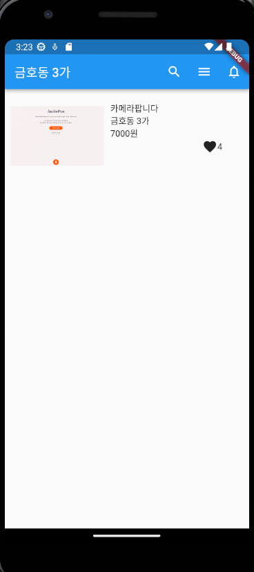

📌 analysis_options.yaml에 추가사항 <br>

```txt
rules:
    prefer_typing_uninitialized_variables : false
    prefer_const_constructors_in_immutables : false
    prefer_const_constructors : false
    avoid_print : false
```

📌 main.dart: stless + tab -> 클래스 이름 설정

## Text, Icon, Image.asset, Container

flutter에서 앱 디자인 넣는 법: 위젯 짜깁기 <br>

- Text('---')
- Icon(Icon.shop)
- Image.asset('경로') -> assets 폴더에 이미지 넣고 pubspec.yaml에 경로 설정
- home: Container(width: 10, height: 50, color: Colors.blue) -> w, h의 단위는 LP

## MaterialApp, 상중하단 구성

- MaterialApp -> 위젯 넣기 위한 객체 -> 구글이 제공하는 위젯, 아이폰 느낌 나는 위젯 == cupertino 위젯을 사용할 수 있음
- caffold: 상중하로 나누어져 있다. appBar(상단), body(중단), bottomNavigationBar(하단)
  ```dart
  home: Scaffold(
      appBar: AppBar(),
      body: Container(),
      bottomNavigationBar: BottomAppBar()
  )
  ```
  뭐 그래서,,

```dart
class MyApp extends StatelessWidget {
  const MyApp({super.key});

  @override
  Widget build(BuildContext context) {
    return MaterialApp(
        home: Scaffold(
      body: Center(
          child: Column(
              mainAxisAlignment: MainAxisAlignment.center,
              crossAxisAlignment: CrossAxisAlignment.center,
              children: [
            Icon(Icons.star),
            Icon(Icons.star),
            Icon(Icons.star)
          ])),
    ));
  }
}
```

이런 느낌으로 진행

## margin, padding, decoration

```dart
class MyApp extends StatelessWidget {
  const MyApp({super.key});

  @override
  Widget build(BuildContext context) {
    return MaterialApp(
        home: Scaffold(
            appBar: AppBar(
              title: Text('앱임'),
            ),
            body: Container(
              width: 100,
              height: 150,
              margin: EdgeInsets.all(20),
              padding: EdgeInsets.fromLTRB(0, 30, 0, 0),
            )));
  }
}
```

container 클래스 안에 margin, padding, decoration(잡다한 파라미터 존재) 을 넣어서 디자인을 할 수 있다.

## Text 스타일 조정

```dart
class MyApp extends StatelessWidget {
  const MyApp({super.key});

  @override
  Widget build(BuildContext context) {
    return MaterialApp(
        home: Scaffold(
      appBar: AppBar(
        title: Text('앱임'),
      ),
      body: SizedBox(
          child: Text(
        '안녕하세요.',
        style: TextStyle(
            color: Color.fromARGB(255, 105, 25, 25),
            fontSize: 20,
            fontWeight: FontWeight.w600),
      )),
    ));
  }
}
```

## appBar, 버튼

```dart
class MyApp extends StatelessWidget {
  const MyApp({super.key});

  @override
  Widget build(BuildContext context) {
    return MaterialApp(
        home: Scaffold(
            appBar: AppBar(
                leading: Icon(Icons.star),
                title: Text('dddd'),
                actions: [Icon(Icons.phone)]),
            body: SizedBox(
              child: ElevatedButton(
                child: Text('버튼'),
                onPressed: () {},
                style: ButtonStyle(),
              ),
            )));
  }
}
```

## Flexible

```dart
class MyApp extends StatelessWidget {
  const MyApp({super.key});

  @override
  Widget build(BuildContext context) {
    return MaterialApp(
        home: Scaffold(
            appBar: AppBar(),
            body: Row(
              children: [
                Flexible(
                  child: Container(color: Colors.blue), flex: 3
                ),
                Flexible(
                  child: Container(color: Colors.green),
                  flex: 7
                ),
              ],
            )));
  }
}

```

## 당근 마켓 화면 구성

```dart
class MyApp extends StatelessWidget {
  const MyApp({super.key});

  @override
  Widget build(BuildContext context) {
    return MaterialApp(
        home: Scaffold(
            appBar: AppBar(
              title: Text('금호동 3가'),
              actions: [
                IconButton(onPressed: () {}, icon: Icon(Icons.search)),
                IconButton(onPressed: () {}, icon: Icon(Icons.menu)),
                IconButton(
                    onPressed: () {}, icon: Icon(Icons.notifications_none)),
              ],
            ),
            body: Container(
                height: 150,
                padding: EdgeInsets.all(10),
                child: Row(
                  children: [
                    Image.asset('assets/download3.png', width: 150),
                    Container(
                        width: 200,
                        padding: EdgeInsets.all(10),
                        child: Column(
                            crossAxisAlignment: CrossAxisAlignment.start,
                            children: [
                              Text('카메라팝니다'),
                              Text('금호동 3가'),
                              Text('7000원'),
                              Row(
                                  mainAxisAlignment: MainAxisAlignment.end,
                                  children: [Icon(Icons.favorite), Text('4')])
                            ]))
                  ],
                ))));
  }
}
```



## 커스텀 위젯

```dart
class MyApp extends StatelessWidget {
  const MyApp({super.key});

  @override
  Widget build(BuildContext context) {
    return MaterialApp(home: Scaffold(appBar: AppBar(), body: ShopItem()));
  }
}

// ShopItem 이라는 커스텀 위젯이 생김
class ShopItem extends StatelessWidget {
  const ShopItem({super.key});

  @override
  Widget build(BuildContext context) {
    return SizedBox(
      child: Text('안녕'),
    );
  }
}
```
